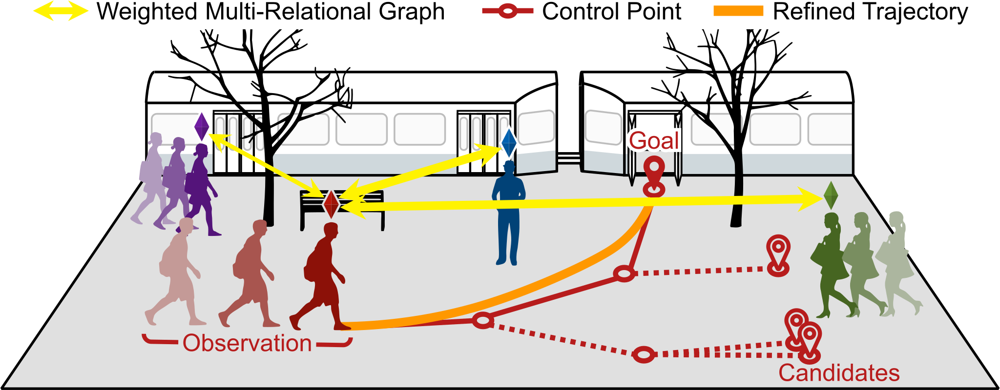

# A Set of Control Points Conditioned Pedestrian Trajectory Prediction
This repository contains the code for control point conditioned prediction and the initial trajectory refinement network for trajectory prediction.

**[A Set of Control Points Conditioned Pedestrian Trajectory Prediction](https://inhwanbae.github.io/publication/graphtern/)**
<br>
<a href="https://InhwanBae.github.io/">Inhwan Bae</a> and
<a href="https://scholar.google.com/citations?user=Ei00xroAAAAJ">Hae-Gon Jeon</a>
<br>Accepted to 
<a href="https://aaai-23.aaai.org/">AAAI 2023</a>

<div align='center'>
  
  <br>An illustration of our Graph-TERN model
</div>


## Graph-TERN Model
* Control points divide each pedestrian's future path into sections and are inferred by each stochastic goal.
* Gaussian mixture model pruning scheme to effectively cutting-off abnormal behaviors of pedestrians.
* Initial trajectory refinement by adding the correction vector field to the linearly interpolated path.

## Model Training
### Setup
**Environment**
<br>All models were trained and tested on Ubuntu 18.04 with Python 3.7 and PyTorch 1.6.0 with CUDA 10.1.

**Dataset**
<br>Preprocessed [ETH](https://data.vision.ee.ethz.ch/cvl/aem/ewap_dataset_full.tgz) and [UCY](https://graphics.cs.ucy.ac.cy/research/downloads/crowd-data) datasets are included in this repository, under `./dataset/`. 
The train/validation/test splits are the same as those fond in [Social-GAN](https://github.com/agrimgupta92/sgan).

### Train Graph-TERN
To train our Graph-TERN on the ETH and UCY datasets at once, we provide a bash script `train.sh` for a simplified execution.
```bash
./scripts/train.sh
```
We provide additional arguments for experiments: 
```bash
./scripts/train.sh <gpu_ids_for_five_scenes>

# Examples
./scripts/train.sh
./scripts/train.sh 0 0 0 0 0
./scripts/train.sh 0 1 2 3 4
```
If you want to train the model with custom hyper-parameters, use `train.py` instead of the script file.
```bash
python train.py --input_size <input_coordinate_dimension> --output_size <output_gaussian_dimension> \
--n_epgcn <number_of_control_point_gcn_layers> --n_epcnn <number_of_control_point_cnn_layers> \
--n_trgcn <number_of_refinement_gcn_layers> --n_trcnn <number_of_refinement_cnn_layers> \
--n_ways <number_of_control_points>  --n_smpl <number_of_samples_for_refine> --kernel_size <kernel_size>\
--obs_seq_len <observation_length> --pred_seq_len  <prediction_length> --dataset <dataset_name> \
--batch_size <minibatch_size> --num_epochs <number_of_epochs> --clip_grad <gradient_clipping> \
--lr <learning_rate> --lr_sh_rate <number_of_steps_to_drop_lr> --use_lrschd <use_lr_scheduler> \
--tag <experiment_tag>
```


## Model Evaluation
### Pretrained Models
We have included pretrained models in the `./checkpoints/` folder.

### Evaluate Graph-TERN
To evaluate our Graph-TERN at once, we provide a bash script `test.sh` for a simplified execution.
```bash
./scripts/test.sh <gpu_ids_for_five_scenes>

# Examples
./scripts/test.sh
./scripts/test.sh 0 0 0 0 0
./scripts/test.sh 0 1 2 3 4
```

If you want to evaluate the model individually, you can use `test.py` with custom hyper-parameters. 
```bash
python test.py --tag <experiment_tag> --n_samples <number_of_multimodal_samples>

# Examples
python test.py --tag graph-tern_eth_experiment
python test.py --tag graph-tern_hotel_experiment
python test.py --tag graph-tern_univ_experiment
python test.py --tag graph-tern_zara1_experiment
python test.py --tag graph-tern_zara2_experiment
```


## Citation
If you find this code useful for your research, please cite our papers :)

[**`DMRGCN (AAAI'21)`**](https://github.com/InhwanBae/DMRGCN) **|** 
[**`NPSN (CVPR'22)`**](https://github.com/InhwanBae/NPSN) **|** 
[**`GP-Graph (ECCV'22)`**](https://github.com/InhwanBae/GPGraph) **|** 
[**`Graph-TERN (AAAI'23)`**](https://github.com/InhwanBae/GraphTERN)

```bibtex
@article{bae2023graphtern,
  title={A Set of Control Points Conditioned Pedestrian Trajectory Prediction},
  author={Bae, Inhwan and Jeon, Hae-Gon},
  journal={Proceedings of the AAAI Conference on Artificial Intelligence},
  year={2023}
}
```
<details>
  <summary>More Information (Click to expand)</summary>

```bibtex
@article{bae2021dmrgcn,
  title={Disentangled Multi-Relational Graph Convolutional Network for Pedestrian Trajectory Prediction},
  author={Bae, Inhwan and Jeon, Hae-Gon},
  journal={Proceedings of the AAAI Conference on Artificial Intelligence},
  year={2021}
}

@inproceedings{bae2022npsn,
  title={Non-Probability Sampling Network for Stochastic Human Trajectory Prediction},
  author={Bae, Inhwan and Park, Jin-Hwi and Jeon, Hae-Gon},
  booktitle={Proceedings of the IEEE/CVF Conference on Computer Vision and Pattern Recognition},
  year={2022}
}

@inproceedings{bae2022gpgraph,
  title={Learning Pedestrian Group Representations for Multi-modal Trajectory Prediction},
  author={Bae, Inhwan and Park, Jin-Hwi and Jeon, Hae-Gon},
  booktitle={Proceedings of the European Conference on Computer Vision},
  year={2022}
}
```
</details>

<br>
